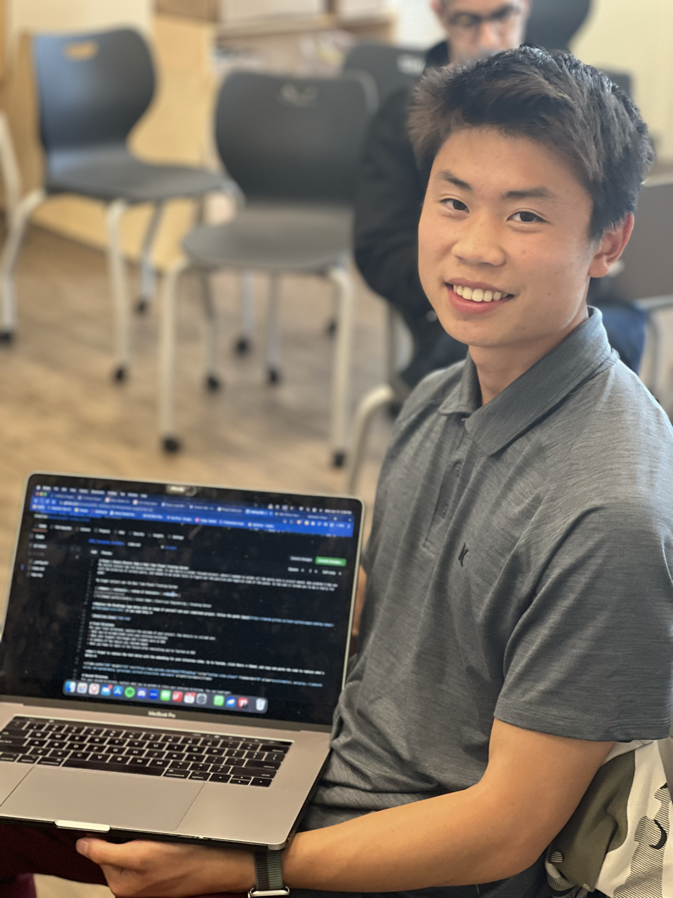

# Real Time Planet Tracking System

My intensive project was the Real Time Planet Tracking System. The project involves a GPS, 2 servos, a laser diode and a lot of calculations, and is able to point at different planets in the sky. 

| **Name** | **School** | **Area of Interest** | **Grade** |
|:--:|:--:|:--:|:--:|
| Bryan L | Mountain View High School | Aerospace Engineering | Incoming Senior

<!---**Replace the BlueStamp logo below with an image of yourself and your completed project. Follow the guide [here](https://tomcam.github.io/least-github-pages/adding-images-github-pages-site.html) if you need help.**--->



  
# Final Milestone
<iframe width="560" height="315" src="https://www.youtube.com/embed/F7M7imOVGug" title="YouTube video player" frameborder="0" allow="accelerometer; autoplay; clipboard-write; encrypted-media; gyroscope; picture-in-picture; web-share" allowfullscreen></iframe>

### Summary
After completing the project to the most basic design I added a few things. The primary one is a new 3d print design for my robot, which includes a shell, gears, and a laser mount. Additionally, I added a button that allows you to choose between different planets. With this new design I can choose any planet in the solar system, and with the gears it can rotate a full 360 degrees. 

New Components: 
3d Prints - Using Onshape, I CADded a new box that holds the arduino and breadboard underneath, the servos and gears above to be able to rotate 360 degrees. The laser mount on top is connected to the servo and "looks" with it. 
Button - Allows me to choose between different planets. 

### Progress
This is more of a finalizing part, as both of these can be considered modifications. Both of these add a new touch to my project. 

### Challenges
My main challenge came with CAD, since I hadn't CAD much before and I was new to it. It was mainly just learning something completely new and then applying it to my project. At first I was CADding very efficiently, making unnecessary edits to my sketches. When I later needed to work with it it was difficult to use, and I ended up reCadding my whole project. In the end I completed my project and learned how to CAD which I believe will help me a lot in engineering. 

### Next Steps 
Although this project is complete, it could use some additional modifiations and changes. One of which is adding the gyroscope (which has a magnetometer). At the moment I need to align the box with north to calibrate, and then I can use the laser to point. With the magnetometer, which acts as a compass, it can "look" instead of having to align itself. 

# Second Milestone
<iframe width="560" height="315" src="https://www.youtube.com/embed/xUnogn_SHWc" title="YouTube video player" frameborder="0" allow="accelerometer; autoplay; clipboard-write; encrypted-media; gyroscope; picture-in-picture; web-share" allowfullscreen></iframe>

### Summary
Using the GPS Module, a couple of servos, and a laser I create my project to track mars accurately. Using data about a planet's daily movement, information about it's orbit and the time and numbers of day since the J2000 epoch(jan 0, 2000), I am able to find the Azimuth and Altitude (which is the number degrees right from north, and the number of degrees up from the horizon). Then I use the Azimuth and Altitude and communicate that to the servos and lasers which actually point a dot at where the planet is (relative to me). 

New Components: 
  - Lasers - These are literal laser pointers, and since they don't require a lot of power they can be directly connected to the digital port for power (as opposed to a digital port, a VCC power port, and a ground port).

At the moment I have my lasers on 24/7, but in the future I will have it toggle on/off after it has found the planet. Also, right now I just have the laser mounted on the Pan Tilt system with tape so I will need to cad and 3d print a laser mount. 

### Progress
This milestone more or less completes the project to the most basic level-being able to point at a planet in real time. With my calculations I can accurately find mars whenever I need to. 

### Challenges
I had lots of challenges and learning experiences leading up to this milestone. 
To begin, my GPS Module just wouldn't work. It turns out it wasn't an issue with the GPS, but rather an issue with the ports. On the Arduino Mega (unlike the Uno), it only communicates via RX and TX ports and not digital ports. 
Another challenge was the servos, again. Since they only go 180 degrees, it would not be able turn around to all locations. However, there is a way around it, where the tilt goes beyond 90 degrees, and goes "upside down". 
Finally the gyroscope, which I did not end up using was a challenge. I wanted it to self adjust, however later realized that it was not necessary to the project. However I learned a lot from the data the gyroscope had to offer, and about rotational matrices. 

### Next Steps
For my 3rd milestone and my modifications I want to add a button that allows me to switch between planets, so that I am able to track multiple ones. I also will CAD a new mount for the lasers. 

# First Milestone
<iframe width="560" height="315" src="https://www.youtube.com/embed/CiB3LzFuGAQ" title="YouTube video player" frameborder="0" allow="accelerometer; autoplay; clipboard-write; encrypted-media; gyroscope; picture-in-picture; web-share" allowfullscreen></iframe>

### Summary
My project involves a plethora of different parts, calculations and precise movements. Before working on the hardware I had to learn about the calculations necessary to get from the statistics of a planet to the degrees relative to the machine it has to "look". Then I had to work with the following hardware components which provide the variables necessary to do the calculations. 

Components: 
  - Arduino Mega - the "brains", controls system with code and connects everything with ports. Has digital ports to distribute and recieve data. 
  - Breadboard - diverts power from the power source to all the modules
  - GPS Module - Finds longitude and latitude, and time. Requires a RX/TX (recieves and transmits data), a VCC power and Ground port
  - Servos and Pan Tilt System - rotates 360 degrees and can look up and down. points a laser into the sky to "track" the planets. Servos use Vcc and Ground port and recieves data. 
  - Gyroscope - recieves and gives data via RX and TX equivalent ports about in which direction it is facing, if it is accelerating and if it is tilting. 

The Arduino Mega acts as the brains to my system, and stores all the code that goes towards everything. It connects its power to the breadboard which distributes power to the rest of the components. The GPS Module and Gyroscope connect to the arduino (to get and give information) and the breadboard (for power) through various ports. The Servos connect to the both the arduino and the breaboard however since it only recieves information (doesn't give information back) there is 3 wires (power, ground and recieve data). 

### Progress
I developed a general understanding behind the math required to solve ascension and declination. I also got all of my hardware components working through connections and test code. 

### Challenges
One challenge I had was with the servos. The servos only got 180 degrees and my top servo actually needs to go a whole 360 degrees (needs to be able to rotate its head to look anywhere in the night sky). One way to combat this problem is to use 2 lasers (on opposite sides), however that will require some tinkering to create. 

### Next Steps
Work on the code that I will implement in all my calculations, solve any final hardware problems and figure out the double laser system. 

# Starter Project: Binary Blaster Game
<iframe width="560" height="315" src="https://www.youtube.com/embed/cKlvox5fjQM" title="YouTube video player" frameborder="0" allow="accelerometer; autoplay; clipboard-write; encrypted-media; gyroscope; picture-in-picture; web-share" allowfullscreen></iframe>

In the video above I demonstrate how to play my game as well as explain different parts of it. 
### Summary
Before I started on my main project, I worked on my starter project, which was the Binary Blaster Game. It was mostly a solder focused project, where I needed to solder all the parts onto a circuit board. 

Components: 
- Resistors and Capacitors - Control the flow of electricity through the build
- Batteries - Provide power
- Switches and LED Buttons - Allow or not allow electricity through the circuit
- LED Lights - Display numbers for the user to visually understand
- Buzzer - Creates noise
- Microcontroller - The "brains", controls all components

The microcontroller acts as the brains as the whole system. The switches allow current from the batteries to flow or not, being an on/off switch, to both the buzzer and the system. If the current flows through (meaning it is on), connection flows to the rest of the system, and the buttons (when pressed) signals to the microcontroller, which signals to the LED lights to display.

### Challenges
One problem I had was with the direction of certain parts, and needed to do diode tests to figure out the positive and negative side of the piece. 

- Learned about polarization
- Continued practice of soldering
- Learned how to use the multimeter
- Learned about diode tests and bias in circuits

### Next Steps
Now I will begin on my intensive project. 

# Schematics 
Here are the schematics to my Onshape CAD. You can view the onshape [here](https://cad.onshape.com/documents/811f844c0036201591b66542/w/7ca7b2cf806acc914a8ccb5e/e/a0914b747509e6813e3df3ae?renderMode=0&uiState=64b96080502aca089d4ef958). 

As for wiring, here is my wiring schematic. 
[Schematic](schematic.png)

# Bill of Materials

| **Part** | **Note** | **Price** | **Link** |
|---|---|---|---|
| Arduino Mega | Acts as the brains of the system, stores code, connects ports, calls actions.  | $55.00 | <a href="https://www.amazon.com/Arduino-A000066-ARDUINO-UNO-R3/dp/B008GRTSV6/](https://a.co/d/82DlYAx)"> Link </a> |
| GT-U7 GPS Module | Gives information about location and time, necessary for calculations | $18.99 | <a href="https://www.amazon.com/Navigation-Positioning-Sensitivity-Consumption-High-Precision/dp/B08MZ2CBP7/ref=sr_1_3?crid=EUNF72IZZWV6&keywords=gt-u7&qid=1689876233&sprefix=gt-u%2Caps%2C606&sr=8-3)"> Link </a> |
| Micro Servo (2) | Motors, turn and rotate to view planet.  | $7.29 (for 2) | <a href="https://www.amazon.com/Sipytoph-Helicopter-Airplane-Walking-Control/dp/B09185SC1W/ref=sr_1_8?crid=EG34UOQG1ZTB&keywords=micro+servo+sg90&qid=1689876515&sprefix=micro+servo+sg%2Caps%2C410&sr=8-8"> Link </a> |
| Laser Diode | Is the pointer for the tracking system | $6.79 (for 10) | <a href="https://www.amazon.com/HiLetgo-10pcs-650nm-Diode-Laser/dp/B071FT9HSV/ref=sr_1_3?crid=2Q5BLK784C55&keywords=laser+diode&qid=1689876609&sprefix=l%2Caps%2C1486&sr=8-3"> Link </a> |
| Button | What is used to switch between planets | $5.99 (for 120) | <a href="https://a.co/d/dSWykzh"> Link </a> |


# Code
```c++
#include <TinyGPSPlus.h>
#include <SoftwareSerial.h>
#include <Servo.h>
Servo myservoAz; // create servo object to control a servo
Servo myservoEl;

/*
   Ports are hooked up to 19 RX1 and 18 TX1, which are Serial1 ports. 

   Pin Setup: 
   GPS: RX1, TX1
   Button: 4
   Laser: 13
   Pan Servo: 8
   Tilt Servo: 9
   )

*/
static const int RXPin = 31, TXPin = 33;
static const uint32_t GPSBaud = 9600;

//boolean for button
int pressed = 0;

// The TinyGPSPlus object
TinyGPSPlus gps;

// The serial connection to the GPS device
SoftwareSerial ss(RXPin, TXPin);

//date and time, location
double year, month, day, hour, minute;
double lat, lng;

int planet = 4; //it is set to 0 rn
//elements of august 16, 2013
const double i[10] = {radians(0.0), radians(7.0052), radians(3.3949), radians(0.0), radians(1.8496), radians(1.3033), radians(2.4869), radians(0.7728), radians(1.7692), radians(17.1695)};//inclination (degrees)
const double o[10] = {radians(0.0), radians(48.493), radians(76.804), radians(0.0), radians(49.668), radians(100.629), radians(113.732), radians(73.989), radians(131.946), radians(110.469)};//longitude of ascending node (degrees)
const double p[10] = {radians(0.0), radians(77.669), radians(131.99), radians(103.147), radians(336.322), radians(14.556), radians(91.500),  radians(169.602), radians(6.152), radians(223.486)};//longitude of perihelion (degrees)
const double a[10] = {0.0, 0.387098, 0.723327, 1.0000, 1.523762, 5.20245, 9.52450, 19.1882, 29.9987, 39.2766};//distance (AU)
const double n[10] = {radians(0.0), radians(4.09235), radians(1.60215), radians(0.985611), radians(0.523998), radians(0.083099), radians(0.033551), radians(0.011733), radians(0.006002), radians(0.004006)};//daily motion (degrees)
const double e[10] = {0.0, 0.205645 , 0.006769, 0.016679, 0.093346, 0.048892, 0.055724, 0.047874, 0.009816, 0.246211};//eccentricity
const double L[10] = {radians(0.0), radians(93.8725), radians(233.5729), radians(324.5489), radians(82.9625), radians(87.9728), radians(216.6279), radians(11.9756), radians(335.0233), radians(258.8717)};//mean longitude (degrees)
//nothing(0(), mercury(1), venus(2), earth(3), mars(4), jupiter(5), saturn(6), uranus(7), neptune(8), pluto(9)

double w2=p[3]-o[3]; 

double array[3];


void setup() {
  Serial.begin(9600);
  Serial1.begin(9600);

  //servos
  myservoAz.attach(8); //Attach the pins //pan is 8, tilt is 9
  myservoEl.attach(9);
  myservoAz.write(90);   //initialize the servo to go to its zero
  myservoEl.write(90); 
  
  //lasers
  pinMode(13, OUTPUT);  

  //button
  pinMode(4, INPUT_PULLUP);
}


void loop() {
  // put your main code here, to run repeatedly:
  lat = gps.location.lat();
  lng = gps.location.lng();

  year = gps.date.year();
  month = gps.date.month();
  day = gps.date.day();
  hour = gps.time.hour();
  minute = gps.time.minute();

  if(digitalRead(4)==1){
    pressed = 0;
  }
  if(digitalRead(4)==0){
    if(pressed == 0){
      planet = planet + 1;
      if(planet == 10){
      planet = 0;
      
      }
    }
    pressed = 1;
  }
  Serial.print("Planet No: ");
  Serial.println(planet);

  if (!gps.date.isValid()){
    Serial.println(F("********** "));
  }
  else{
    char sz[32];
    sprintf(sz, "%02d/%02d/%02d ", gps.date.month(), gps.date.day(), gps.date.year());
  
    calculate(&*array);
    Serial.print("Alpha: ");
    Serial.println(array[0]);
    Serial.print("Delta: ");
    Serial.println(array[1]);
    Serial.print("Distance: ");
    Serial.println(array[2]);
    Serial.print("Latitude: ");
    Serial.println(gps.location.lat());
    Serial.print("Longitude: ");
    Serial.println(gps.location.lng());
    Serial.print("Date(UTC): ");
    Serial.println(sz);
  }
  if (!gps.time.isValid()){
    Serial.print(F("******** "));
  }
  else{
    char sz[32];
    sprintf(sz, "%02d:%02d:%02d ", gps.time.hour(), gps.time.minute(), gps.time.second());
    Serial.print("Time(UTC): ");
    Serial.println(sz);
  }
  smartDelay(1000);


}


static void smartDelay(unsigned long ms){
  unsigned long start = millis();
  do {
    while (Serial1.available())
      gps.encode(Serial1.read());
  } while (millis() - start < ms);
}


void calculate(double *array){

  double w=p[planet]-o[planet]; //argument of perihelion (radians) 

  double days = 8399.5+181; //right now it is setup to july of 2023, too lazy to add code cuz its not that deep. this is the num of days since august 16 2013 (this is the only thing needed to update every time)
  days = days + day; //add the day of the month
  days = days + ((hour+(minute/60))/24); 
  days=days-4975.5;
  //days=928;//temporary for checking

  //mean anomaly
  double m=days*n[planet]+L[planet]-p[planet];
  while(m>360){
    m=m-360;
  }
  //mea anomaly of earth
  double mE=days*n[3]+L[3]-p[3];
  while(mE>360){
    mE=mE-360;
  }

  //true anomaly
  double v = m + (2 * e[planet] - 0.25 * pow(e[planet],3) + 5/96 * pow(e[planet],5)) * sin(m) + (1.25 * pow(e[planet],2) - 11/24 * pow(e[planet],4)) * sin(2*m) + (13/12 * pow(e[planet],3) - 43/64 * pow(e[planet],5)) * sin(3*m) + 103/96 * pow(e[planet],4) * sin(4*m) + 1097/960 * pow(e[planet],5) * sin(5*m);
  double vE = mE + (2 * e[3] - 0.25 * pow(e[3],3) + 5/96 * pow(e[3],5)) * sin(mE) + (1.25 * pow(e[3],2) - 11/24 * pow(e[3],4)) * sin(2*mE) + (13/12 * pow(e[3],3) - 43/64 * pow(e[3],5)) * sin(3*mE) + 103/96 * pow(e[3],4) * sin(4*mE) + 1097/960 * pow(e[3],5) * sin(5*mE);

  //radius vector
  double r=a[planet]*(1-pow(e[planet],2))/(1+e[planet]*cos(v));
  double rE=a[3]*(1-pow(e[3],2))/(1+e[3]*cos(vE));

  //heliocentric coordinates of planet
  double x = r * (cos(o[planet]) * cos(v+w) - sin(o[planet]) * sin(v+w) * cos(i[planet]));
  double y = r * (sin(o[planet]) * cos(v+w) + cos(o[planet]) * sin(v+w) * cos(i[planet]));
  double z = r * (sin(v + w) * sin(i[planet]));

  //heliocentric coordinates of earth
  double xE = rE * cos(vE + p[3]);
  double yE = rE * sin(vE + p[3]);
  double zE = 0;

  //geocentric ecliptic coordinates of the planet 
  double xg = x - xE;
  double yg = y - yE;
  double zg = z - zE;

  //geocentric equatorial coordinates of the planet
  double ec=radians(23.439292);
  double Xq = xg;
  double Yq = yg * cos(ec) - zg * sin(ec);
  double Zq = yg * sin(ec) + zg * cos(ec);

  //converting rectangular coordinates to right ascension and declination
  //alpha = right ascension, delta = declination
  double alpha = atan(Yq/Xq);
  alpha = degrees(alpha);
  if (Xq<0){
      alpha = alpha + 180;

  }
  if (Xq>0 and Yq<0){
        alpha = alpha + 360;
  }

  alpha = alpha/15;
  double delta = atan(Zq/sqrt(pow(Xq,2) + pow(Yq, 2)));
  delta = degrees(delta);
  double distance = sqrt(pow(Xq,2) + pow(Yq, 2) + pow(Zq, 2));

  double d = 8399.5+181; //right now it is setup to july of 2023, too lazy to add code cuz its not that deep. this is the num of days since august 16 2013 (this is the only thing needed to update every time)
  d = d + day; //add the day of the month

  double LST = (100.46 + 0.985647 * d + lng + 15 * (hour + minute / 60) + 360) - (((int)((100.46 + 0.985647 * d + lng + 15 * (hour + minute / 60) + 360)/360))*360);
  while(LST>360){
    LST=LST-360;
  }
  double HA = (LST - alpha*15 + 360) - ((int)((LST - alpha*15 + 360)/360))*360;
  double xx = cos(HA * (M_PI / 180)) * cos(delta * (M_PI / 180));
  double yy = sin(HA * (M_PI / 180)) *cos(delta * (M_PI / 180));
  double zz = sin(delta * (M_PI / 180));
  double xhor = xx * cos((90 - lat) * (M_PI / 180)) - zz *sin((90 - lat) * (M_PI / 180));
  double yhor = yy;
  double zhor = xx * sin((90 - lat) * (M_PI / 180)) + zz *cos((90 - lat) * (M_PI / 180));
  double az = atan2(yhor, xhor) * (180 / M_PI) + 180;
  double alt = asin(zhor) * (180 / M_PI);
  Serial.print("Azimuth: ");
  Serial.println(az);
  Serial.print("Altitude: ");
  Serial.println(alt);

  double pan = az/2; //its kind of backwards. essentially if 0 degrees is 0 degrees compass (direct north), then 45 degrees is 315, 90 is 270, etc...
  double tilt = alt+90;

  myservoAz.write(pan);
  myservoEl.write(tilt);
  digitalWrite(13, HIGH);

  array[0] = alpha;
  array[1] = delta;
  array[2] = distance;
}
```
